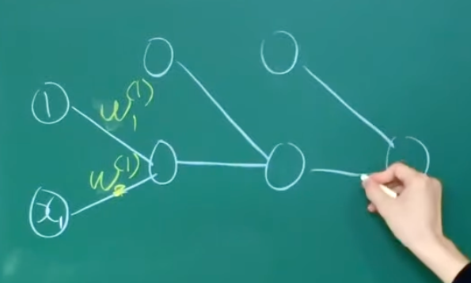
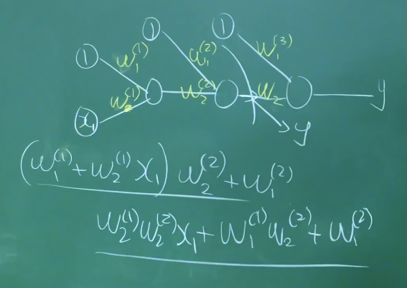
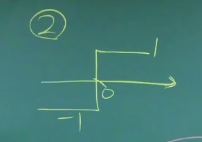
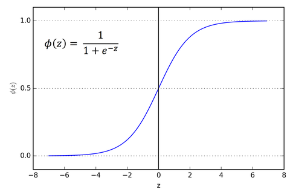

# 혁펜하임 딥러닝 강의
# Day1.
- **[딥러닝] 1-1강. 머신러닝 기초부터 탄탄히!! (선형 회귀)**
    - **지도학습**
    - 강아지인걸 아는 사진을 많이 많이 보여줘서 기계를 학습 시키는것
    - **강화학습(비지도 학습)**
    - 바둑판을 보고 이게 이길 수 있는지 없는지 판단하는 것 → 기계가 사람을 가르치는 느낌ㅋㅋ
    - **Linear regression  (선형회귀)**
    - x축과 y축의 상관관계를 알고싶을떄
        
        
    - 인간은 이런걸 보았을때 대충 어떤 느낌인지 안다
    - 선형회귀는 error가 가장 적은 함수를 뽑아내는 느낌
    ->즉 가장 피팅한 함수를 찾는과정이다        
    - 근데 노랑색 선상에 무조건 있는게 아니니깐, 아래와 같은 행렬식으로 표현할 수 있다.
    - 같다는게 아니라 저렇게 가고싶다는 걸 의미 ㅇㅇ
    - 즉 최대한 비슷하게 만드는 [a,b]를 찾자는 것임
    - 선형대수적으로 표현하면 아래와 같음
        
        
        
    - 내가 찾고자하는 x에 대한 파라미터에 대해 선형하기에 **Linear regression**
    - 결국 우리가 찾고자 하는 문제는 아래와 같음
    - $A \underbar x \simeq \underbar y$ → $\underbar y - A \underbar x$
    이렇게 하면 문제가 뭐냐면 양의 에러, 음의 에러가 있을 수 있으니깐, 절대값으로 변경해한다.
    - 하지만, 미분해야하는데 절대값은 짜증나니깐 아래처럼 ㄲ
    - $(\underbar y - A \underbar x)^{T} (\underbar y - A \underbar x)$ : Cause 벡터니깐
    - 결국 위 문제를 풀면 된다
    - 풀이법은 3가지가 있다
        - Gradient descent
        - Newton-Raphson
        - Least squares
- **[딥러닝] 1-2강. 이거 하나만 이해하면 일생이 편해집니다. (경사하강법 vs Newton method)**
    - 즉 문제는 아래와 같음
    - $minimize \space (\underbar y - A \underbar x)^{T} (\underbar y - A \underbar x)$하는 $x (=\begin{vmatrix} \underbar a \\ \underbar b \end{vmatrix})$ 를 구하여라!
        
        
        
    - 우리는 이러한 data로 훈련을 했는데 만약 data가 없으면 어캐?
    - 그냥 $y = A \underbar x$ 에 모르는 데이터를 대입하면 그만이다. → 이게 바로 머신러닝이다
    - **Gradient descent**
        - $(\underbar y - A \underbar x)^{T} (\underbar y - A \underbar x) = \left| {y= A \underbar x} \right|^{2}$
        - 결국 1차함수의 제곱꼴이다
        - A도 알고 y를 알면 x에 대하여 부르트포싱을 하는 것이다.
        - Gradient하면 가장 가파른 방향을 가르킨다.
        → 즉, Gradient한 방향의 역으로 가야한다
        - $minimize \space (\underbar y - A \underbar x)^{T} (\underbar y - A \underbar x)$ 를 미분해보자! Scalar를 Vector로 미분
            $$
            f(a,b) df \rightarrow \frac{\partial f}{\partial a} da + \frac{\partial f}{\partial b} db=\begin{vmatrix} \frac{\partial f}{\partial a} & \frac{\partial f}{\partial b}\end{vmatrix} \begin{vmatrix} da\\ db\end{vmatrix} \newline x =\begin{vmatrix} \frac{\partial f}{\partial x^{T}}\\ \end{vmatrix}
            $$
            
        - 하지만, 이건 너무 번거로워,,,쉽게 하는 방법을 가르쳐줄게
        - $df$를 구하시구, $dx$앞에 있는 애가 그라디언트임.
        - 그럼, $df$를 어떻게 구해?
            - $firstorder[f(x+dx) - f(x)]$
            - $=((\underbar y - A \underbar x) + d\underbar x)^{T} ((\underbar y - A \underbar x) + d\underbar x) - ((\underbar y - A \underbar x) )^{T} ((\underbar y - A \underbar x) )$
            - $=[((\underbar y - A \underbar x) + d\underbar x)^{T}] [((\underbar y - A \underbar x) + d\underbar x) - ((\underbar y - A \underbar x))^{T} ((\underbar y - A \underbar x) )]$
            - $=-dx^{T}A^{T}(\underbar y - A \underbar x) - (\underbar y - A \underbar x)^{T} A dx$
            - $=-2(\underbar y - A \underbar x)^{T} A dx$
            - 즉, Gradient한 결과는 아래와 같다
            - $-2(\underbar y - A \underbar x)^{T} A$
            - $x \leftarrow x+2A^{T} (\underbar y - A \underbar x)$ :
                
                
                
            - 지금 우리는 방향은 아는데 얼만큼 가는지를 모른다
            - $x_{k+1} \leftarrow x_{k}+2A^{T} (\underbar y - A \underbar x) \times  LearningRate$ : 적당한 LearningRate가 중요함
    - **Newton-Raphson**
        - 훨씬 더 파팍 빠르게 갈 수 있다
        - 근데 잘 안쓰임
        - Cause, 미분을 한번 더 해야함
        - 기본적으로 Zero-finding
        - $x_{k+1} \leftarrow x_{k} - \frac{f'(x_{n})}{f''(x_{n})}$
            - 스칼라를 벡터로 미분하면 벡터 → 한번 더 미분 → 행렬이 되어서 정확히는 두번 미분하고 나눈것은 역행렬을 곱한것
        - $x_{k+1} \leftarrow x_{k}+2A^{T} (\underbar y - A \underbar x) \times  LearningRate$ 에서
        - $2A^{T} (\underbar y - A \underbar x)  =-f'(x)$
        - $LearningRate = f''(x)$
        - ㅎ한번 미분한거는 자코비안, 두번미분한거는 헤시안
            - → 빡세서 잘 안씀ㅋㅋ

# Day2.
- **[딥러닝] 1-3강. 이건 진짜 꼭 봐주세요...!! (그라디언트와 방향도함수)**
- $minimize \space (\underbar y - A \underbar x)^{T} (\underbar y - A \underbar x)$
  - **directional derivative**
  - $$Gradient = \begin{vmatrix} \frac{\partial f}{\partial x1} \\ \frac{\partial f}{\partial c2}\end{vmatrix} $$
  - 이게 무슨 의미냐이면 가장 가파르게 올라가는 방향이다~ (최단거리 정상을 가는것이지)
  - 왜 그럴까?
  - 입력은 벡터인데 출력은 스칼라이다
  - $f(x1,x2) = f(\begin{vmatrix} x1 \\ x2\end{vmatrix})=f(x)$
    - 벡터의 함수이다
  - 값은 스칼라이다.
  - $\lim_{a\to 0}\frac{f(x+hu) = f'(x)}{h}$
    - 이는 특정방향으로의 미분을 의미한다
  - 위의 3d 그래프를 $u$ 함수로 커팅을 한다.
  - $f(x1,x2) = f(\begin{vmatrix} x1 \\ x2\end{vmatrix})=f(x) = f(\begin{vmatrix}x+hu_1 \\ x2+hu_2\end{vmatrix})$
  - 
- **[딥러닝] 2-1강. ANN**
  - **Linear regression(review)**
    - 키와 몸무게를 입력받을떄 fit한 1차 함수를 찾는 과정
    - 근데 무엇이 선형하느냐?
      - 파라미터 $A,B$에 대해 리니어를 한 것이다
  - Non -Linera regression은 Nerual Net으로 구현가능하다
  - **Nerual Net**
    - 
    - 이러한 것들을 단순하게 표현해볼 것이다. 수식적으로는 ㅇㅇ
    - 역활에 연두를 해두자~
    - 입력 → 다음신경 세포
    - 
      - Weighted Sum이 여러개있으면 NN이다
  - **Linear regression by NN**
    - 
    - 위 그림을 잘보자 Linear regression은 결국 아래와 같은 Weight sum의 연속이다
    - $a \times x_{n}+1 \times b$
    - 이때 $\sum(y_i-(ax_i+b)^2$ 이 가장 작은 a,b를 찾는 것
    - 뭐 병렬하게 할 수 있지만,
    - 의 각 input에 FIFO로 값을 밀어넣을 수 도 있는 것이 아닌가?
    - 이를 설명한것이 아래의 그림이다.
    - 
    - 앞으로는 $a,b$ 만 나오는게 아니라 무진장 나오기에 $w_1,w_2,...$
    - 그리고 레이러를 표현할 수 있게 $w_{i}^{(j)}$
      - $j$는 레이어를 표현한 것이다
    - 
    - 이와 같은 다양한 Linear regression을 표현해 볼 것임
    - Case1. $y=ax^2+bx+c$
      - $$\begin{vmatrix}
          {x_1}^2& x_1& 1\\
          {x_2}^2& x_2& 1\\
          {x_3}^2& x_3& 1\\
          {x_4}^2& x_4& 1\\
          .&.\\.&.\\.&.\end{vmatrix}
          \begin{vmatrix}
          a\\b\\c
          \end{vmatrix} =
          \begin{vmatrix}
              y_1\\y_2\\y_3\\y_4\\.\\.\\.\\
          \end{vmatrix}
       $$
      - 2차함수라 하여 Linear regression이 아닌 것이 아님
      - $\begin{vmatrix}a\\b\\c\end{vmatrix}$에 대하여 선형하면 됨
      - 행렬곱으로 나타나면 무조건 선형함 : 선대에 나온다
      - 글고 NN으로 나타내기 위해서는 Input node에 아래와 같이 표현해주면 되지 않을까?
      - 아이폰 사진 첨부
    - Case2. $y=ax^b$
    - 얘는 리니어 안한거 아니냐?
      - ㄴㄴ, a,b에 대해 선형'화' 할 수 있음
    - $$
        y = ax^b \rightarrow \ln y = \ln a + b \ln x \\
        \tilde{y} : \ln y, 
        \tilde{a} : \ln a, 
        b : b, 
        \tilde{x} : \ln x \\
     $$
     $$
        \begin{vmatrix}
        \tilde{x_1}, 1 \\
        \tilde{x_2}, 1 \\
        \tilde{x_3}, 1 \\ .\\.\\.\\
        \end{vmatrix}
        \times
        \begin{vmatrix}
            \tilde{y_1} \\
            \tilde{y_2} \\
            \tilde{y_3} \\ .\\.\\.
        \end{vmatrix}
     $$
      - 이제는 알거 없고 $b, \tilde{a}$ 만 알면됩니당
    - Case3. $y=\frac{e^{ax^2+b+c}}{1+e^{ax^2+bx+c}}$
    -  $$
        y=\frac{e^{ax^2+b+c}}{1+e^{ax^2+bx+c}} \\ \rightarrow
        \frac{y}{1-y} = \frac{\frac{e^{ax^2+bx+c}}{1+e^{ax^2+bx+c}}}{\frac{e^{ax^2+bx+c}}{e^{ax^2+bx+c}}} \\
        = e^{ax^2+bx+c}\\
        \ln(\frac{y}{1-y}) = ax^2+bx+c
       $$
    - $$
        ln(\frac{y}{1-y}) = \tilde{y}
     $$
    - $$
      \tilde{y} = ax^2+bx+c
     $$
    - 오 뭔가 Case.1과 비슷해졌다
    - Case5. $y=\frac{ax}{b+x}$
      - 얘네는 안된다~
      - 수식전개로는 개지랄을 해도 안된다~
      - **Non-Linear regression**을 해야한다~
# Day3
- **[딥러닝] 2-2강. ANN의 필수요소! 활성화 함수 (Activation function)**
  - Non-Linear regression 을 NN으로 하고싶다
    - Deep 하면 되지 않을까?
    - NN을 복수의 Layer로 하면 된다
    - 
    - 
    - 그냥 Linera regression이랑 똑같다!
    - 즉, Deep 하다고, Non-Linear regression이 되는 것이 아님!
  - **Activation function!**
    -  
       -  사실 요 동그라미에서 하는 일이 있다!
       -  Activation function!
          -  ($y=x$ : 그대로 값을 뱉는 Activation function) 이면 Linear regression
    - 즉, Activation function이 Non-Linear하고 Deep하면 Non-Linear regression이 가능하다
    - **대표적인 Activation function 4가지**
      - Linear regression
      - Percceptron
        - 
        - 이 함수를 Activation function으로 사용하면 Percceptron 이라 부름
      - Sigmoid
        - 
        - Logistic regression
      - Softmax regression
        - $$\frac{e^{x_i}}{\sum e^{x_i}}$$
- **[딥러닝] 3-2강. 머신이 강아지를 학습하는 과정 (Logistic regression & Likelihood) | 이진 분류 문제**
  - Logistic regression
    - 확률적인 접근이 가능하다는게 핵심이다.
    - $sigmoid func : g = \frac{e^x}{1+e^{x}}$ 
    - Sigmoid 함수는 안그래도 비선형하는데 Loss함수의 ^2 까지 들어가면 그라디언트 조져도 고여버린다
    - 이를 해결하기 위해 **Likelihood** 를 사용한다
  - Likelihood
    - A라는 주머니에 검은공 2개, 흰공 1개
    - B라는 주머니에 검은공 1개, 흰공 1개
    - $$
      P(칠|A) = \frac{2}{3}, P(안칠|A) = \frac{1}{2} \\
      P(칠|B) = \frac{1}{2}, P(안칠|A) = \frac{1}{2} \\
      조건부 확률\\ (칠|A) + P(안칠|A) = 1\\P(칠|B) + P(안칠|B) = 1\\
      Likelihood\\P(칠|A) + P(칠|B)\\P(안칠|A) + P(안칠|B)\\ $$
    - 즉, Likelihood는 뒤에 있는 것에 대한 함수임
  - **Dog classification**
    - 이미지를 벡터라 생각해보자!
    - 강아지 사진을 찢어서 벡터로 둔다고 생각하자
    - NN에 Sigmoid 활성화 함수를 붙인 상황이라고 생각해보자
    - $$
      x_1 = 강아지 사진, Y_1 = 1\\
      x_2 = 고양이 사진, Y_2 = -1\\
      x_3 = 말 사진, Y_3 = -1\\
      x_4 = 강아지 사진, Y_4 = -1 $$
    - 이런식으로 사진을 마구 마구 보여주자 : 학습하는 거임
    - 그러면 NN을 통과한 사진이 강아지 일 확률은 아래와 같음
    - $$
      P(Y_{i}|x_{i}) = sig(f(x_i,w)), Y_{i} = 1 : 강아지 사진일 확률\\
      1-sig(f(x_i,w)), Y_{i} = -1 : 강아지 사진이 아닐 확률
     $$
    - $$Loss = -\log(\prod_{i=1}^N{p(Y_i|X_i)}): 이때 N은 보여주는 이미지 수$$
    - $$ -\sum_{i}^N\log(P(Y_i|x_i)) $$
  - **Animal Classificatoin**